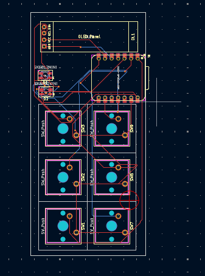
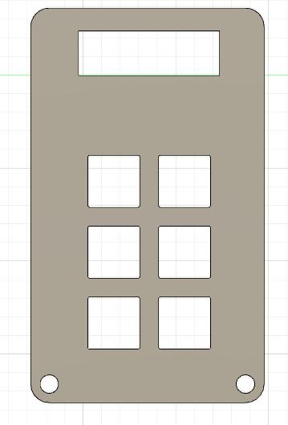
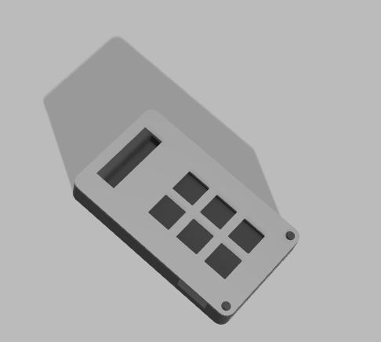

# LeoPad

A custom mechanical keyboard macropad featuring RGB backlighting and powered by the Seeed Studio XIAO RP2040 microcontroller.

## Overview

LeoPad is a 12-key mechanical keyboard PCB designed for custom macropad builds. The board features Cherry MX compatible switches, addressable RGB LEDs, and a compact form factor perfect for programmable shortcuts and macros.







## Features

- **12 Cherry MX Compatible Switches** - Standard PCB-mount mechanical switches
- **RGB Backlighting** - SK6812MINI addressable RGB LEDs for per-key lighting
- **XIAO RP2040 Microcontroller** - Powered by Seeed Studio's XIAO RP2040 module with RP2040 chip
- **4-Layer PCB Design** - Professional PCB layout with proper power and signal routing
- **Open Source Hardware** - Full KiCad design files included

## Project Structure

```
leopad/
├── CAD/                    # 3D CAD models
│   └── jianhackpad.step   # 3D model in STEP format
├── Firmware/               # Firmware code (to be added)
├── PCB/                    # KiCad PCB design files
│   ├── jainhackpad-schematic.kicad_sch  # Schematic design
│   └── jianhackpad.kicad_pcb            # PCB layout
└── resources/              # Project resources
    ├── 3d-model.jpeg       # 3D model render
    ├── 3d-overview.jpeg    # 3D overview render
    └── pcb.png             # PCB render
```

## Hardware Specifications

### Components

- **Microcontroller**: Seeed Studio XIAO RP2040
  - RP2040 dual-core ARM Cortex-M0+ processor
  - USB-C connectivity
  - 14 GPIO pins
  
- **Switches**: Cherry MX compatible (12x)
  - PCB mount
  - 1.00u key spacing
  
- **LEDs**: SK6812MINI (12x)
  - Addressable RGB LEDs
  - Per-key lighting support
  - WS2812B compatible protocol

### PCB Details

- **Layers**: 4-layer board
- **Thickness**: 1.1962mm
- **Design Tool**: KiCad 9.0

## Bill of Materials (BOM)

| Qty | Reference | Component | Description | Notes |
|-----|-----------|-----------|-------------|-------|
| 1 | U1 | XIAO-RP2040-DIP | Seeed Studio XIAO RP2040 Module | RP2040 microcontroller with USB-C |
| 12 | SW1-SW12 | Cherry MX Switch | Mechanical keyboard switch | PCB mount, 1.00u spacing |
| 12 | D1-D12 | SK6812MINI | Addressable RGB LED | PLCC4, 3.5x3.5mm, WS2812B compatible |
| 1 | OL1 | OLED Display | SSD1306 OLED Display | 0.91" 128x32, I2C interface |
| 1 | - | PCB | Custom PCB | 4-layer, 1.1962mm thickness |
| 1 | - | USB-C Cable | USB-C to USB-A cable | For power and programming |

### Optional Components

- Keycaps (12x) - Cherry MX compatible keycaps
- Case/Enclosure - Custom case design (see CAD folder)
- Stabilizers - If using larger keycaps (2u or larger)

### Component Sources

- **XIAO RP2040**: [Seeed Studio](https://www.seeedstudio.com/XIAO-RP2040-v1-0-p-5026.html)
- **SK6812MINI LEDs**: Available from Adafruit, SparkFun, or AliExpress
- **Cherry MX Switches**: Available from various keyboard vendors (KBDfans, NovelKeys, etc.)
- **OLED Display**: Generic SSD1306 0.91" OLED modules available from various suppliers

## Getting Started

### Prerequisites

- KiCad 9.0 or later (for viewing/editing PCB files)
- Seeed Studio XIAO RP2040 module
- 12x Cherry MX compatible switches
- 12x SK6812MINI RGB LEDs
- USB-C cable
- Soldering equipment

### Building the PCB

1. Open the KiCad project file (`jianhackpad.kicad_pro`) in KiCad
2. Review the schematic (`jainhackpad-schematic.kicad_sch`) and PCB layout (`jianhackpad.kicad_pcb`)
3. Generate Gerber files for PCB manufacturing:
   - File → Fabrication Outputs → Gerbers
   - File → Fabrication Outputs → Drill Files
4. Order PCBs from your preferred manufacturer (JLCPCB, PCBWay, etc.)
5. Order components according to the Bill of Materials (BOM)

### Assembly

1. Solder the XIAO RP2040 module to the PCB
2. Solder the SK6812MINI LEDs in their designated positions
3. Install and solder the Cherry MX switches
4. Flash firmware to the XIAO RP2040 (see Firmware section)

### Firmware

Firmware code will be added to the `Firmware/` directory. The board is compatible with popular keyboard firmware frameworks such as:

- [QMK](https://qmk.fm/)
- [KMK](https://github.com/KMKfw/kmk_firmware)
- [ZMK](https://zmk.dev/)

## Documentation

- Schematic: `PCB/jainhackpad-schematic.kicad_sch`
- PCB Layout: `PCB/jianhackpad.kicad_pcb`
- 3D Model: `CAD/jianhackpad.step`

## License

[Add your license here - e.g., MIT, GPL, CERN OHL, etc.]

## Contributing

Contributions are welcome! Please feel free to submit issues, pull requests, or suggestions for improvements.

## Acknowledgments

- Seeed Studio for the XIAO RP2040 module
- KiCad community for PCB design tools
- Cherry for the MX switch standard

## Support

For questions, issues, or support, please open an issue on the project repository.

